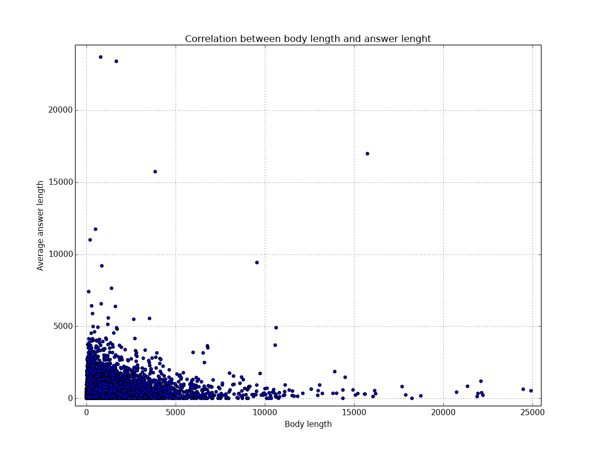

==================================================
  Intro to Hadoop and MapReduce: Final Project
==================================================

:Authors:
    Renato L. F. Cunha

Introduction
============

This repository contains my implementation of the Final Project for Udacity's
Introduction to Hadoop course.

This code was written for Hadoop, and is comprised of the following files:

 * common.py: Common functionality shared by all modules below
 * study_groups_mapper.py: Mapper for the Study Groups Exercise
 * study_groups_reducer.py: Reducer for the Study Groups Exercise
 * student_times_mapper.py: Mapper for the Student Times Exercise
 * student_times_reducer.py: Reducer for the Student Times Exercise
 * popular_tags_mapper.py: Mapper for the Top Tags Exercise
 * popular_tags_reducer.py: Reducer for the Top Tags Exercise
 * average_length_mapper.py: Mapper for the Post and Answer Length Exercise
 * average_length_reducer.py:  Reducer for the Post and Answer Length Exercise

Running the code
================

Because all the mappers and reducers here implemented depend on functionality
present only in the common.py module, one *must* include that file in the same
directory where MapReduce runs.

Using Hadoop Stream with Cloudera's distribution, one could define the
following function:

.. code:: bash

    function run_mapreduce_with_common() {
        hadoop jar \
        /usr/lib/hadoop-0.20-mapreduce/contrib/streaming/hadoop-streaming-2.0.0-mr1-cdh4.1.1.jar \
        -mapper $1 -reducer $2 -file $1 -file $2 -file $3 -input $4 -output $5
    }

Student times
-------------

With the `run_mapreduce_with_common()` function defined, running the code for the
student times problem would be like:

.. code:: bash

    run_mapreduce_with_common student_times_mapper.py student_times_reducer.py \
    common.py forum-input student-times-output

Study groups
------------

With the `run_mapreduce_with_common()` function defined, running the code for the
study groups problem would be like:

.. code:: bash

    run_mapreduce_with_common study_groups_mapper.py study_groups_reducer.py \
    common.py forum-input study-groups-output

Popular tags
------------

With the `run_mapreduce_with_common()` function defined, running the code for the
popular tags problem would be like:

.. code:: bash

    run_mapreduce_with_common popular_tags_mapper.py popular_tags_reducer.py \
    common.py forum-input popular-tags-output

Average length
--------------

With the `run_mapreduce_with_common()` function defined, running the code for the
average length problem would be like:

.. code:: bash

    run_mapreduce_with_common average_length_mapper.py average_length_reducer.py \
    common.py forum-input average-length-output

Answers to the final questions
==============================

Is it a good idea to user Hadoop/Mapreduce to process forum data?
-----------------------------------------------------------------

It depends on what kind of data you're interested in.

If the data is already in the RDBMS and the information you need is stored in
a way that facilitates the data retrieval from the RDBMS side, then it might
not be worth it going through the overhead of exporting the data, importing it
into Hadoop/Mapreduce, writing the program to gather the statistics you're
interested in and, finally, running it and getting those statistics.

Consider, for example, the Stack Exchange data explorer[1]. It has various
queries that show information about user behavior and does *not* use MapReduce,
but standard SQL queries.

That being said, I'd say that it *is* indeed a good idea to run
MapReduce/Hadoop when you're interested in the *contents* of what users posts,
or any other data that is unstructured by default (or on data that come from
*many different sources*). But even then, stored procedures in a RDBMS could go
a long way in providing that functionality.

In the end, it does make sense when your data is scattered across various
machines, comes from different sources and has no structure. And, of course,
you don't have that data in a RDBMS in the first place. If you had it there,
then it could be possible that the data was not that unstructured.

So, what I would need to know to make that decision is that:
 * Where is the data located? Is it already in a RDBMS? No? MapReduce might
   work fine, then.
 * Is it structured? No? MapReduce might work fine, then.
 * Would it be hard to add structure to it?
 * Would I benefit from having the flexibility of writing arbitrary programs to
   process the data I'm interested in?

If the answers to these questions are favorable to MapReduce, then we're good
to use it.

[1] http://data.stackexchange.com/stackoverflow/queries

Improvements to the search functionality
----------------------------------------

There are some obvious improvements, like searching for tags and for
posts/questions by a given user.

We could get really fancy by using not only keyword-based searches, but adding
some kind of weighting functionality to the index. Suppose, for example, that
questions/answers written by users with greater reputation indicate a better
"quality" to that text. We could *combine* the user database with the post
database and add that information to the index as well. Then, once the index was
built, the search engine could opt to sort by using this new criterion. Clearly,
this is extensible and multiple weights could be added as well. For example,
questions/answer more upvoted, less upvoted, etc.

Correlation between question length and average response length
---------------------------------------------------------------

There doesn't seem to be any, as shown in the figure below.

